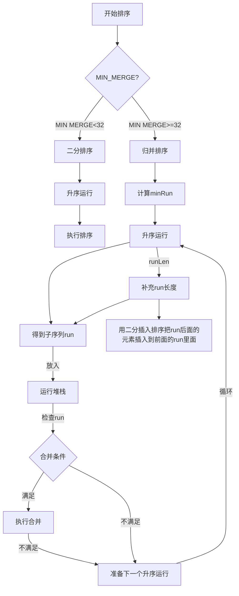
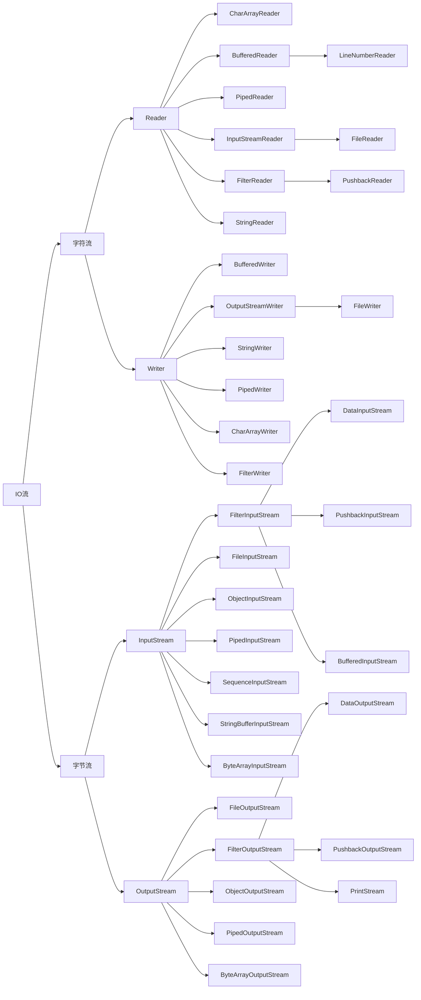

# Java笔记

- [Java笔记](#java笔记)
  - [Java基础](#java基础)
    - [JVM](#jvm)
      - [JVM(Java Virtual Machine) Java虚拟机](#jvmjava-virtual-machine-java虚拟机)
      - [JRE(Java Runtime Environment) Java 运行时环境](#jrejava-runtime-environment-java-运行时环境)
      - [JDK(Java Development Kit) Java 开发工具包](#jdkjava-development-kit-java-开发工具包)
    - [DOS（Disk Operate System）磁盘操作系统](#dosdisk-operate-system磁盘操作系统)
      - [常用命令](#常用命令)
  - [Java数据类型](#java数据类型)
    - [基本数据类型](#基本数据类型)
      - [数值型](#数值型)
      - [字符型](#字符型)
      - [布尔类型](#布尔类型)
    - [引用数据类型](#引用数据类型)
      - [类(class)](#类class)
      - [接口(interface)](#接口interface)
      - [数组(\[\])](#数组)
  - [线程共享与线程私有](#线程共享与线程私有)
    - [java运行时内存分为“线程共享”和“线程私有”两部分，以下哪些属于“线程共享”部分](#java运行时内存分为线程共享和线程私有两部分以下哪些属于线程共享部分)
  - [在根类Object中包含以下方法](#在根类object中包含以下方法)
  - [Java常用包](#java常用包)
  - [Java三大特性](#java三大特性)
    - [封装](#封装)
    - [继承](#继承)
    - [多态](#多态)
    - [java的动态绑定机制](#java的动态绑定机制)
  - [finalize](#finalize)
  - [修饰符访问权限](#修饰符访问权限)
  - [类变量](#类变量)
    - [存放位置](#存放位置)
    - [静态变量被所有对象共享，在类加载的时候就生成了](#静态变量被所有对象共享在类加载的时候就生成了)
  - [深入理解main方法](#深入理解main方法)
  - [代码块](#代码块)
    - [代码块的加载顺序](#代码块的加载顺序)
    - [方法调用](#方法调用)
  - [单例模式](#单例模式)
    - [饿汉模式](#饿汉模式)
    - [懒汉模式](#懒汉模式)
      - [线程安全问题](#线程安全问题)
  - [抽象](#抽象)
  - [java设计模式](#java设计模式)
    - [1.单例模式](#1单例模式)
    - [2.工厂设计模式](#2工厂设计模式)
    - [3.模版模式](#3模版模式)
    - [4.适配器模式](#4适配器模式)
    - [5.建造者模式](#5建造者模式)
    - [6.桥接模式](#6桥接模式)
    - [7.装饰器模式](#7装饰器模式)
    - [设计模式的七大原则](#设计模式的七大原则)
  - [异常(Throwable)](#异常throwable)
  - [String类](#string类)
    - [String类常用方法](#string类常用方法)
  - [StringBuffer](#stringbuffer)
    - [StringBuffer常用方法](#stringbuffer常用方法)
  - [StringBuilder](#stringbuilder)
    - [StringBuilder常用方法参考StringBuffer](#stringbuilder常用方法参考stringbuffer)
  - [什么时候该用String,StringBuffer,StringBuilder](#什么时候该用stringstringbufferstringbuilder)
  - [StringJoiner](#stringjoiner)
  - [Math类](#math类)
  - [Arrays类](#arrays类)
    - [排序](#排序)
  - [八大排序](#八大排序)
    - [冒泡排序](#冒泡排序)
    - [插入排序](#插入排序)
    - [选择排序](#选择排序)
    - [希尔排序](#希尔排序)
    - [快速排序](#快速排序)
    - [归并排序](#归并排序)
    - [堆排序](#堆排序)
    - [桶排序](#桶排序)
  - [Timsort流程图](#timsort流程图)
  - [集合 Collection](#集合-collection)
    - [List](#list)
      - [ArrayList](#arraylist)
      - [Vector](#vector)
      - [LinkedList](#linkedlist)
    - [Set](#set)
      - [HashSet](#hashset)
    - [LinkedHashSet](#linkedhashset)
    - [TreeSet](#treeset)
  - [Map](#map)
    - [HashMap](#hashmap)
    - [LinkedHashMap](#linkedhashmap)
    - [TreeMap](#treemap)
      - [TreeMap的数据结构](#treemap的数据结构)
    - [HashTable](#hashtable)
    - [Properties](#properties)
  - [总结-开发中如何选择集合实现类(记住)](#总结-开发中如何选择集合实现类记住)
  - [并发和并行](#并发和并行)
  - [进程和线程](#进程和线程)
  - [锁](#锁)
    - [Synchronized 同步锁(互斥锁)](#synchronized-同步锁互斥锁)
  - [文件](#文件)
    - [文件的创建](#文件的创建)
    - [常用方法](#常用方法)
    - [面向字符的输入流类都是Reader的子类](#面向字符的输入流类都是reader的子类)
  - [TCP网络编程](#tcp网络编程)
    - [服务端代码](#服务端代码)
    - [客户端代码](#客户端代码)
    - [三次握手四次挥手](#三次握手四次挥手)
    - [常用指令](#常用指令)
  - [MySQL配置](#mysql配置)
    - [MySQL常用命令](#mysql常用命令)
    - [DOS下操作MySQL](#dos下操作mysql)
    - [常见存储引擎](#常见存储引擎)
    - [索引](#索引)
  - [反射](#反射)
    - [类加载过程](#类加载过程)
    - [通过反射机制获取类的构造器，属性，方法](#通过反射机制获取类的构造器属性方法)
  - [Spring6](#spring6)
    - [IoC容器](#ioc容器)
  - [AOP(Aspect Oriented Programing)](#aopaspect-oriented-programing)
    - [代理模式](#代理模式)
    - [相关术语](#相关术语)
    - [动态代理分类](#动态代理分类)
    - [AspectJ](#aspectj)
  - [Spring-jdbc事务](#spring-jdbc事务)
  - [Resource](#resource)
  - [i18n国际化](#i18n国际化)
  - [Validation校验](#validation校验)
  - [AOT、JIT](#aotjit)
    - [Graalvm](#graalvm)
    - [Native lmage](#native-lmage)
  - [Mybatis](#mybatis)
  - [SpringMVC](#springmvc)
  - [Spring+SpringMVC+Mybatis整合](#springspringmvcmybatis整合)
  - [乱码问题](#乱码问题)
  - [Junit5常用注解](#junit5常用注解)
  - [SpringBoot](#springboot)

## Java基础

### JVM

#### JVM(Java Virtual Machine) Java虚拟机

- JVM常用命令
- 1、jps：查看本机java进程信息。
- 2、jstack：打印线程的栈信息，制作线程dump文件。
- 3、jmap：打印内存映射，制作堆dump文件
- 4、jstat：性能监控工具
- 5、jhat：内存分析工具
- 6、jconsole：简易的可视化控制台
- 7、jvisualvm：功能强大的控制台
- 8、jinfo(Configuration Info for Java)：查看虚拟机配置信息 jinfo -sysprops pid

#### JRE(Java Runtime Environment) Java 运行时环境

- JRE = JVM + Java核心类库

#### JDK(Java Development Kit) Java 开发工具包

- JDK = JRE + Java开发工具

### DOS（Disk Operate System）磁盘操作系统

#### 常用命令

- dir (directory)查看当前目录
- cd (change directory) 切换到其他目录
- md (make directory) 创建文件夹
- rd (remove directory) 删除文件夹
- del (delete) 删除文件
- tree 查看指定目录下的所有子目录
- cls 清屏
- exit 退出

## Java数据类型

### 基本数据类型

#### 数值型

- 整数类型，存放整数(byte[1],short[2],int[4],long[8])
- 浮点(小数)类型(float[4],double[8])
  浮点数 = 符号位 + 指数位 + 尾数位
  
|类型|占用存储空间|范围|
|:---:|:---:|:---:|
|byte[字节]|1字节|-127~128 ,   -$2^7$~ $2^7$-1|
|short[短整型]|2字节| -$2^{15}$ ~ $2^{15}$-1|
|int[整型]|4字节|-$2^{31}$~$2^{31}$-1|
|long[长整型]|8字节|-$2^{63}$~$2^{63}$-1|
|float[单精度]|4字节|-3.403E38~3.403E38|
|double[双精度]|8字节|-1.798E308~1.798E308|

#### 字符型

- char[2],存放单个字符'a'

#### 布尔类型

- boolean[1],存放 true或false

### 引用数据类型

#### 类(class)

#### 接口(interface)

#### 数组([])

## 线程共享与线程私有

### java运行时内存分为“线程共享”和“线程私有”两部分，以下哪些属于“线程共享”部分

- 私有:java虚拟机栈，程序计数器，本地方法栈    共享:java堆，方法区

## 在根类Object中包含以下方法

- clone(); 创建并返回此对象的一个副本
- equals(); 指示一个对象是否与此对象"相等"
- finalize(); 当垃圾回收器确定不存在该对象的引用时，有对象的垃圾回收器进行调用，可以人工调用，但是不确定什么时候执行
- getClass();返回此Object的运行时的类
- notify(); 唤醒在此对象监视器上等待的单个线程
- notifyAll(); 唤醒在此对象监视器上等待的所有线程
- hashCode(); 返回该对象的哈希码值，此方法是为了提高哈希表的性能
- toString(); 返回该对象的字符串表示
- wait(); 在其他线程调用此对象的notify()方法或notifyAll()
  方法前，导致当前线程等待

## Java常用包

- java.lang.* // 是java基础包，默认引入，无须再引
- java.util.* // 是系统提供的工具包，工具类
- java.net.*  // 是网络包，网络开发
- java.awt.*  // 是java的界面开发，GUI

## Java三大特性

### 封装

### 继承

### 多态

- 多态的本质：
- 建立在封装和继承之上
- 1.方法多态
  (1)方法重载体现多态 (2)方法重写体现多态
- 2.对象多态
  对象的编译类型和运行类型可以不一致
  编译类型在定义时就确定
  运行类型是可以变化的（转型）,可以通过getClass()方法来查看运行类型 instanceof
  编译类型看 = 的左边， 运行类型看 = 的右边
- 向上转型：父类的引用指向了子类的对象;
    父类  父类的引用 = new 子类()
- 向下转型：把指向子类对象的父类引用还原成指向子类对象的子类引用
    子类  子类的引用 = (子类)父类的引用

### java的动态绑定机制

- 1.当调用对象的方法时，该方法会和对象的内存地址/运行类型绑定
- 2.当调用对象的属性时，没有动态绑定机制，哪里声明，哪里使用

## finalize

- 当对象被回收时，系统自动调用finalize方法
- 什么时候被回收：当某个对象没有任何引用时，jvm会认为该对象是垃圾
- 就会使用垃圾回收机制销毁该对象，在销毁该对象之前，会调用finalize方法
- 垃圾回收机制由是JVM垃圾回收算法决定的，也可以由System.gc()主动触发

## 修饰符访问权限

- public:  同包可见 本类可见 子类可见 包外可见
- protect: 同包可见 本类可见 子类可见
- default: 同包可见 本类可见
- private: 本类可见

## 类变量

### 存放位置

- jdk1.8以前，存放在方法区
- jdk1.8之后，存放在堆里面
  会生成一个类对象class对象，所有对象实例化的模版，从类对象中可以获取静态变量的信息
  静态变量存放在class对象的尾部

### 静态变量被所有对象共享，在类加载的时候就生成了

## 深入理解main方法

 1. main方法被jvm调用，所以权限必须是public

 2. main方法在被调用时不产生任何对象，所以必须是静态的static

 3. 该方法接收String类型的数组参数，该方法保存执行java命令时传递给所运行类的参数

## 代码块

### 代码块的加载顺序

 1. 父类的静态代码块/静态成员变量
 2. 子类的静态代码块/静态成员变量
 3. 父类的代码块/成员变量
 4. 父类的构造方法
 5. 子类的代码块/成员变量
 6. 子类的构造方法

### 方法调用

- 静态代码块只能调用静态方法/静态成员变量
- 普通代码块可以任意调用

## 单例模式

### 饿汉模式

- java.lang.Runtime
- private Runtime() {} // 构造器私有化
- private static final Runtime currentRuntime = new Runtime(); //创建实例私有化
- public static Runtime getRuntime() {  // 静态方法返回实例公有化
        return currentRuntime;
    }

### 懒汉模式

- 构造器私有化
- 声明一个对象，但不实例化
- 通过公有的静态方法,每次都判断该对象是否有实例
- 没有则实例化该对象并返回,有则返回该实例

#### 线程安全问题

- 使用 volatile 对 声明的对象加锁
- 使用 synchronized(类名.class) 对 实例化过程加锁
- 双重空指针判断对象
- 或者 采用 内部类方式
- 静态内部类，在调用getInstance方法时才会被加载，而且是线程安全的

## 抽象

- 只能用来修饰类和方法
- 抽象方法不能被声明为private,final,static

## java设计模式

- 设计模式分为三种类型，共23种
  1. 创建型模式：单例模式、抽象工厂模式、原型模式、建造者模式、工厂模式。
  2. 结构型模式：适配器模式、桥接模式、装饰模式、组合模式、外观模式、享元模式、代理模式。
  3. 行为型模式：模版方法模式、命令模式、访问者模式、迭代器模式、观察者模式、中介者模式、备忘录模式、解释器模式（Interpreter模式）、状态模式、策略模式、职责链模式(责任链模式)。

### 1.单例模式

- 避免重复实例化对象，确保一个类在整个应用程序中只有一个实例对象，并提供全局的访问
- 饿汉式
- 懒汉式
- 双重检索
- 静态内部类
- 枚举类

### 2.工厂设计模式

- 提高代码的复用性

### 3.模版模式

- 提高代码的复用性

### 4.适配器模式

### 5.建造者模式

### 6.桥接模式

### 7.装饰器模式

### 设计模式的七大原则

  1. 单一职责原则
  2. 接口隔离原则
  3. 里式替换原则
  4. 依赖倒转原则
  5. 开闭原则
  6. 迪米特法则
  7. 合成复用原则

## 异常(Throwable)

- Error
- Exception

## String类

- 实现了 Comparable、Serializable、CharSequence接口
- 串行化（可以网络传输，也可以保存到文件）

### String类常用方法

- equals,equalsIgnoreCase 比较是否相等/ 忽略大小写比较是否相等
- length 获取字符串长度
- indexOf(),lastIndexOf() 查找以...开始的字符或字符串第一次出现/最后一次出现的索引位置，没有找到返回-1
- substring 字符串截取,(5)只有一个参数时返回字符串长度5之后所有的字符串,
  (0,5)两个从参数时返回从索引0开始到4之间的字符串
- toUpperCase,toLowerCase 字符串升序转成大写，字符串降序转成小写
- contact 字符串拼接 contact("a","b") 返回字符串"ab"
- replace 返回一个替换后的新的字符串，对原字符串没有影响
- split 返回一个根据固定格式分割后的字符串数组
- toCharArray 返回一个字符数组
- compareTo 比较两个字符串，前者大返回正数，前者小返回负数，相等返回0
  两个字符串相比，先比较字符串长度，如果长度一致，则逐个比较单个字符的ASCLL码的大小返回差值
  常用ASCLL码（0=48,A=65,a=97）
- format 字符串格式化
- isEmpty 字符串是否为空
- charAt 返回字符串数组索引对应的字符

## StringBuffer

- 线程安全，方法有synchronized关键字修饰
- 默认 16个字节 + 构造器传入参数的大小

### StringBuffer常用方法

- append 字符串拼接(拼接在字符串之后)
- delete(int start, int end) 删除 从start开始到end之前的字符，不包括end
- replace(int start, int end, String str) 替换从start开始到end之前的字符，不包括end
- insert()插入

## StringBuilder

- 非线程安全
- 如果在单线程情况下，StringBuilder更快

### StringBuilder常用方法参考StringBuffer

## 什么时候该用String,StringBuffer,StringBuilder

- 如果字符串存在大量的修改，单线程情况下选择StringBuilder,存在多线程情况选择StringBuffer
- 如果字符串很少修改，被多个对象引用，使用String，例如配置信息

## StringJoiner

- java8新增的，基于StringBuilder实现，用来实现字符串拼接的场景
- Collector.joining()底层就是用StringJoiner实现的

## Math类

- pow 幂
- sqrt 开平方
- abs 绝对值
- ceil 向上取整
- floor 向下取整
- round 四舍五入

## Arrays类

### 排序

- sort方法源码：
- 如果排序数组长度小于等于2，直接返回，默认为有序数组
- 如果排序数组长度小于32，使用二分查找法binarySort
- 否则使用Timsort

## 八大排序

### 冒泡排序

- 比较相邻的两个数，前一个数比后一个数大，则前一个数和后一个数交换位置

### 插入排序

- 比较每个元素，插入放到正确的位置（始终满足比前一个数大，比后一个数小，
  如果目标数比排序前的一个数小，则前一个数移动一位后插入前一个数原先所在位置，每次当前的数都插入到合适的位置，不管插入到第几位，前面的数都要往后移动）

### 选择排序

- 1.找到最小的元素，并和第一位数交换
- 2.找到第二小的元素，并和第二位数交换
- 重复上面的步骤，直到最后一个元素，排序完成

### 希尔排序

- 1.将原数组按(步长/2)拆分成两个数组，对每个数组做插入排序
- 2.将原数组按(步长/4)拆分成四个数组，对每个数组做插入排序
- 直到拆分成最小单元，并做插入排序后排序完成

### 快速排序

- 找基准值，排序基准值左侧，左侧排完交换基准值位置，再找下一个基准值，递归重复

### 归并排序

- 1.把数组不断划分成子序列，划成长度只有2或者1的子序列。
- 2.然后利用临时数组，对子序列进行排序，合并，再把临时数组的值复制回原数组。
- 3.反复操作1~2步骤，直到排序完成

### 堆排序

### 桶排序

- 找出最大值，最小值。
- 根据数组的长度，创建出若干个桶。
  桶的数量 bucketCount = (max - min) / length + 1;
  桶的大小 size = (max - min + 1)/bucketCount
- 遍历数组的元素，根据元素的值放入到对应的桶中。
- 对每个桶的元素进行排序(可使用快排，插入排序等)。
- 按顺序合并每个桶的元素，排序完成。

## Timsort流程图



## 集合 Collection

- Collection有两个重要的子接口 List  Set

### List

- ArrayList,LinkedList,Vector 都实现了List接口，都可以使用Iterator迭代器，foreach循环遍历

#### ArrayList

- 底层维护的是一个数组,transient Object[] elementData
- ArrayList是非线程安全的
- 动态扩容机制，如果使用无参构造器，new ArrayList()默认的是一个空数组{},第一次使用add()方法时扩容到默认的容量10,第二次在原先10的基础上按照1.5倍扩容(即10*1.5=15),第三次容量为22(15*1.5=22),以此类推……
  如果使用有参构造器,new ArrayList(n)生成的是一个容量为n的数组({null,null,null,null……n个null}),下一次扩容时同样按照1.5倍扩容(即n*1.5),第三次容量为(n*1.5*1.5),以此类推……
- 最大容量不超过 Integer.MAX_VALUE - 8 (即$2^{31}$-1-8)

#### Vector

- 底层维护的是一个数组,protected Object[] elementData
- Vector是线程安全的,操作方法带有synchronized关键字
- 动态扩容机制，如果使用无参构造器，默认容量为10，下一次扩容为当前容量*2;如果使用有参构造器,默认容量为构造器容量大小,若指定每次扩容大小(构造器两个参数),那每次扩容+n,若未指定扩容机制,那每次扩容为当前容量*2
- 最大容量不超过 Integer.MAX_VALUE - 8 (即$2^{31}$-1-8)

#### LinkedList

- 底层维护的是一个双向链表，链表的两个属性first和last分别指向链表的头结点和尾节点
- 每个节点对象又维护了prev、next、item三个属性，
  通过prev指向前一个节点，next指向后一个节点，来实现双向链表
- LinkedList是非线程安全的，没有实现同步
- 特点是对元素的增加和删除非常方便，不存在扩容问题

### Set

#### HashSet

- HashSet底层实际上是HashMap,只是这个HashMap的key存放的是add的对象，value存放的是默认的 new Object()
- 参考HashMap的数据结构和扩容机制

### LinkedHashSet

- LinkedHashSet 是HashSet的子类，底层维护的是一个LinkedHashMap(数组table+双向链表)
- LinkedHashSet有head和tail(头和尾)，每个节点都有before和after属性，使用链表来维护元素的次序，使得元素看起来是有序的(确保插入顺序和遍历顺序一致)
- 详细解释：数组类型是HashMap$Node,存放的节点类型是LinkedHashMap$Entry,HashMap.Node实现了Map.Entry接口(是在内部类发生的继承关系),Entry有before和after属性

### TreeSet

- TreeSet底层是TreeMap
- 存放的是TreeMap$Entry对象

## Map

### HashMap

- 数据结构：数组-->链表-->红黑树
  1. 数组存放的是HashMap$Node对象，HashMap$Node实现了Map.Entry接口
  2. 可以使用迭代器循环遍历，通过Map.Entry的getKey()和getValue方法获取存放的key-value值
- 扩容机制
  1. 默认容量的大小为16,扩容后的大小为当前容量的2倍
  2. 判断扩容的临界值为当前容量curentcapacity*0.75(DEFAULT_LOAD_FACTOR加载系数)
  3. 扩容的时机
   (1). 当添加的元素超过临界值(THRESHOLD)时触发扩容
   (2). 当单个节点链表的长度超过8个时触发扩容
  4. 链表什么时候转换成红黑树
   当链表的长度超过8(TREEIFY_THRESHOLD)并且数组的容量超过64(MIN_TREEIFY_CAPACITY)的时候，链表自动转换成红黑树
- 如何判断节点的添加位置
  1. 添加一个节点元素p时，计算hash值，并把hash值转成索引
  2. 根据判断索引位置index是否有值:
     (1).如果没有则放到索引位置
     (2).如果有则判断当前对象是否相等equals(可重写equals方法)，相等说明当前列表存在相同元素则不添加，如果不相等则添加到当前位置元素的后面node.next=p

### LinkedHashMap

- LinkedHashMap是HashMap的子类

### TreeMap

- TreeMap是一个双列集合，底层维护的是一个红黑树
- 构造器
- 可以选择无参构造器
- 也可以选择有参构造器，传入一个实现Comparable接口的匿名内部类(自定义比较规则)

#### TreeMap的数据结构

- 二叉查找树的定义：每个结点的值按照大小排列的二叉树，方便对节点的值进行查找
- 特点：
  1. 若左子树不空，则左子树上所有结点的值均小于它的根结点的值
  2. 若右子树不空，则右子树上所有结点的值均大于它的根结点的值
  3. 左、右子树也分别为二叉排序树
  4. 没有相等的结点(key)
- 查找方式
  1. 从根结点开始，如果要查找的数据等于结点的值，那就返回
  2. 如果要查找的数据小于结点的值，那就在左子树中递归查找
  3. 如果要查找的数据大于结点的值，那就在右子树中递归查找

- 平衡二叉树

### HashTable

- HashTable的数据结构
  1. 底层是一个数组 Hashtable$Entry[],初始化大小默认为11，临界加载因子0.75,
  2. 扩容机制：(oldCapacity << 1) + 1  乘以2再加1
- 但是HashTable的键值对Key-Value都不允许为空
- 使用方法与HashMap一致(put,remove,is)
- HashTable是线程安全的,方法有synchronized修饰

### Properties

- Properties继承HashTable，特点与HashTable类似
- 也是使用一种键值对Key-Value的形式来保存数据
- Properties用于从xxx.properties文件中，加载数据到Properties对象并进行数据读取和修改
- 所以xxx.properties一般常用做配置文件

## 总结-开发中如何选择集合实现类(记住)

- 在开发中，选择什么集合实现类，主要取决于业务操作特点，然后根据集合实现类特性进行选择，分析如下:
  1. 先判断存储的类型(一组对象[单列]或一组键值对[双列])
  2. 一组对象[单列]: Collection接口
      允许重复: List
        增删多: LinkedList [底层维护了一个双向链表]
        改查多: ArrayList [底层维护 Object类型的可变数组]
      不允许重复: Set
        无序: HashSet [底层是HashMap ，维护了一个哈希表 即(数组+链表+红黑树)]
        排序: TreeSet
        插入和取出顺序一致: LinkedHashSet，维护数组+双向链表
  3. 一组键值对: Map
    键无序: HashMap [底层是: 哈希表 jdk7: 数组+链表，jdk8: 数组+链表+红黑树]
    键排序: TreeMap
    键插入和取出顺序一致: LinkedHashMap
    读取文件 Properties

## 并发和并行

- 并发：有多个线程需要同时处理，但是cpu来不及调度（比如单核cpu任务调度）
- 并行：有多个线程正在同时处理（比如双核cpu处理两个线程，一个cpu处理一个线程）

## 进程和线程

- 一个进程可以开启多个线程
  1. 可以通过继承Thread类重写run方法来开启一个线程
  2. 也可以通过实现Runable接口重写run方法,并new Tread(Object)来开启线程
   这里涉及到设计模式[静态代理]
  3. 都是通过调用start()-->然后由jvm来调用start0()来决定什么时候执行
- 常用方法
  1. getName(),setName()获取线程名称/修改线程名称
  2. start()线程启动
  3. run()调用run方法
  4. getPriority(),setPriority获取线程优先级/设置线程优先级
  5. wait()线程等待
  6. sleep()线程休眠
  7. notify(),notifyAll()
  8. interrupt()线程中断
  9. yield()线程礼让，不一定成功
  10. join()线程插入，强制执行另一个线程
  11. setDaemon(true)设置为守护线程
  12. isAlive()判断线程是否处于活动状态
  13. currentThread()返回当前正在执行的线程对象
  14. stopThread()线程终止
- 用户线程和守护线程
  1. 用户线程也叫工作线程，当线程的任务执行完或通知方式结束
  2. 守护线程一般为工作线程服务，当所有用户的工作线程结束，守护线程自动结束
  3. 最常见的是垃圾回收机制
- 线程的几种状态
  1. new尚未启动的线程处于此状态
  2. ruanable执行中的线程处于此状态(细分为ready就绪状态，running正在执行)
  3. blocked被阻塞等待监视器锁定的线程处于此状态
  4. waiting正在等待另一个线程执行特定动作的线程处于此状态
  5. timed_waiting正在等待lingyige线程执行动作到达等待时间的线程处于此状态
  6. terminated已退出的线程处于此状态

## 锁

### Synchronized 同步锁(互斥锁)

- 同步方法或者代码块
- 只允许有一个获取到锁的对象去操作方法或者代码块，直到方法或代码块执行结束释放锁之后，才允许下一个获取到锁的对象进入
- 同步(非静态)方法的锁可以是this,也可以是其他对象(要求是同一个对象)
- 同步(静态)方法的锁是当前类本身
- 非公平锁
- 局限性：执行的效率低

## 文件

### 文件的创建

```java
  1. // 根据当前目录创建文件
     File file = new File("d:\\xxx.txt");
     file.createNewFile();
  2. // 根据父目录文件+子路径创建文件
     String parentPath = "d:\\"
     File parentFile =  new File(parentPath);
     String fileName = "xxx.txt"
     File file = new File(parentFile,fileName);
     file.createNewFile();
  3. // 根据父目录+子路径创建文件
     String parentPath = "d:\\"
     String fileName = "xxx.txt"
     File file = new File(parentFile,fileName);
     file.createNewFile();
```

### 常用方法

- getName获取文件名
- getAbsolutePath获取文件绝对路径
- getParent获取文件父级目录
- length获取文件大小
- exists判断文件是否存在
- isFile判断是否是文件类型
- isDirectory判断是否是目录

### 面向字符的输入流类都是Reader的子类



## TCP网络编程

- 什么是TCP/IP：Transmission Control Protocol/Intenet Protocol 传输控制协议/因特网互联协议
- 网络通讯协议分4层：应用层、传输层(TCP)、网络层(IP)、物理+数据链路层
  1. 传输：用户数据-->app首部-->TCP首部-->IP首部-->以太网首部
  2. 接收：以太网首部-->IP首部-->TCP首部-->app首部-->用户数据

### 服务端代码

```java
  // 初始化监听端口
  int port =8899;
  ServerSocket serverSocket = new ServerSocket(port);
  // 等待链接
  Socket socket = serverSocket.accept();
  // 接收数据
  BufferedReader br =  new BufferedReader(
                new InputStreamReader(socket.getInputStream()));
  String str ="";
  while(true){
      str = br.readLine();
      if(str ==null) {
          break;
      }
      System.out.println(str);
  }
  // 发送数据
  BufferedWriter bw = new BufferedWriter(
          new OutputStreamWriter(socket.getOutputStream()));
  bw.write("hello cline");
  bw.newLine();
  bw.flush();
  socket.shutdownOutput();
  // 关闭流，关闭链接
  bw.close();
  br.close();
  socket.close();
  serverSocket.close();
```

### 客户端代码

```java
  // 初始化监听端口
  int port = 8899;
  Socket socket = new Socket(InetAddress.getLocalHost(),port);
  // 接收数据
  BufferedReader br = new BufferedReader(
          new InputStreamReader(socket.getInputStream()));
  String str = "";
  while (true) {
      str = br.readLine();
      if (str == null) {
          break;
      }
      System.out.println(str);
  }
  // 发送数据
  // 读取文件
  String targetFilePath = "d:\\hello.png";
  BufferedInputStream bis = new BufferedInputStream(
          new FileInputStream(filePath));
  // 转换成字符流
  ByteArrayOutputStream bos = new ByteArrayOutputStream();
  byte[] bytes = new byte[1024];
  int readlen = 0;
  while ((readlen = bis.read(bytes)) != -1) {
      bos.write(bytes, 0, readlen);
  }
  bos.close();
  byte[] byteArray = bos.toByteArray();
  // 字符流输出到socket中，发送给服务器
  BufferedOutputStream bos = new BufferedOutputStream(socket.getOutputStream());
  bos.write(byteArray);
  socket.shutdownOutput();
  bis.close();
  bos.close();
  socket.close();
```

### 三次握手四次挥手

- 三次握手建立连接：

 1. 客户端发送带有syn标识的数据包给服务端
 2. 服务端接收成功后回传客户端一个带有syn/ack标识的数据包，表示服务端收到
 3. 客户端再回传服务端一个带有ack标识的数据包，表示客户端收到，完成三次握手

- 四次挥手断开连接

 1. 客户端发送一个FIN来关闭客户端到服务端的数据传输，客户端进入FIN_WAIT_1状态
 2. 服务端收到FIN后，发送一个ACK给客户端，确认序号为收到序号+1，服务端进入CLOSE_WATI状态
 3. 服务端发送一个FIN，用来关闭服务端到客户端的数据传输，服务端进入LAST_ACK状态
 4. 客户端收到FIN后，客户端进入TIME_WAIT状态，发送一个ACK给服务端，确认序号为收到序号+1，服务端进入CLOSED状态，完成四次挥手

### 常用指令

1. netstat -an 查看当前主机网络情况，包括端口监听情况和网络连接情况
2. netstat -an | more 可以分页显示

## MySQL配置

- 先检查之前是否有安装遗留，删除
- HKEY_LOCAL_MACHINE\SYSTEM\CurrentControlSet\Services\EventLog\  mysql相关
- HKEY_LOCAL_MACHINE\SYSTEM\CurrentControlSet\Services\  mysql相关
- HKEY_LOCAL_MACHINE\SYSTEM\ControlSet001\Services\EventLog\  mysql相关
- HKEY_LOCAL_MACHINE\SYSTEM\ControlSet001\Services\  mysql相关
- C:\ProgramData mysql相关

1. 下载好mysql
2. 准备配置文件my.ini
3. 初始化数据库mysqld --initialize --console记住密码
4. 安装mysql服务mysqld -install mysql3307(如果服务已存在删除服务sc delete mysql3307)
   注意:如果安装另一个实例必须指定my.ini(mysqld --install mysql3308 --defaults-file="D:\mysql-slave\my.ini)
   也可以通过show variables like '%dir%';检查当前实例是否正确在指定目录下
   通过新开cmd窗口netstat -ano|more 检查端口
5. 启动服务net start mysql
6. 登录数据库mysql -P3007 -uroot -p
7. 修改密码为rootALTER USER 'root'@'localhost' IDENTIFIED WITH mysql_native_password BY 'root';
8. 关闭数据库net stop mysql
9. show variables like '%dir%';
<!-- [mysql]
# 设置 mysgl 客户端默认字符集
default-character-set=utf8mb4
[mysqld]
# 设置 3306 端口
port = 3306
bind-address = ::
bind-address = 0.0.0.0
server-id = 1
# 设置 mysql 的安装目录
basedir= D:\mysql-8.2.0-winx64
# 设置 mysql 数据库的数据的存放目录
datadir= D:\mysql-8.2.0-winx64\data
# 允许最大连接数
max_connections=200
# 服务端使用的字符集默认为 8 比特编码的 latin1 字符集
character-set-server=utf8mb4
# 创建新表时将使用的默认存储引警
default-storage-engine=INNODB
# 默认使用“mysql_native_password”插件认证
default_authentication_plugin=mysql_native_password 
join_buffer_size = 128M
sort_buffer_size = 16M
read_rnd_buffer_size = 16M 
sql_mode=NO_ENGINE_SUBSTITUTION,STRICT_TRANS_TABLES
#开启log-bin,忽略默认数据库
log-bin=mysql-bin 
binlog-ignore-db=information_schema
binlog-ignore-db=performance_schema
binlog-ignore-db=mysql
binlog-ignore-db=sys-->

- 主从同步
- 主库操作
  show master status;记录bin和position
  //创建同步的帐号
  create user 'testuser'@localhost IDENTIFIED BY 'password';
  // 帐号授权
  grant replication client,replication slave on *.* to 'testuser'@localhost;
  flush privileges;
- 从库操作
- stop slave;
  change master to master_host='localhost',master_port=3307,master_user='testuser',master_password='password',master_log_file='binlog.000011',master_log_pos=902;
  start slave;
  show slave status\G;

### MySQL常用命令

- show databases;显示所有数据库
- use database_name;使用哪个数据库
- show tables;显示当前数据库下所有的表
- desc table_name;显示表结构
- exit退出MySQL

### DOS下操作MySQL

- 备份数据库（把端口号为3307的java_record数据库备份到d:\\bak.sql）
- mysqldump -P3307 -uroot -p -B java_record > d:\\bak.sql

### 常见存储引擎

- Innodb默认存储引擎
- Myisam，索引文件和数据文件单独存放，读取快
- Memory，读取快，也叫堆引擎

### 索引

- 索引失效
  1. 使用like '%'
  2. 使用or的两个条件不全是索引
  3. 使用索引的字段参与运算
  4. 使用索引的字段使用了函数
- 聚族索引和非聚族索引
  1. 主键是聚族索引
  2. 唯一索引，复合索引，前缀索引都是辅助索引，是非聚族索引
  3. Innodb使用的是聚簇索引，MyISam使用的是非聚簇索引

## 反射

- 通过类对象可以知道类的所有信息，包括文件路径，类名，构造器，方法，属性等

### 类加载过程

- 编译阶段：把代码编译成二进制文件
- 加载阶段：把二进制文件通过类加载器ClassLoader加载到虚拟机中
  1. 验证阶段：文件是否以cafe开头
  2. 准备阶段：初始化静态代码块，静态变量
  3. 解析阶段：符号引用转换成直接引用
- 运行阶段：初始化（创建对象，属性赋值等）

### 通过反射机制获取类的构造器，属性，方法

- 获取类对象 Object o =Class.forName("classPath");
- 获取构造器对象：getDeclaredConstructors
- 获取属性：getDeclaredFileds
- 获取方法：getDeclaredMethods
- 爆破.setAccessible(true)
- 返回修饰符数值：getModifiers(默认是0，public是1，private是2，protected是4，static是8，final是16)
- 返回属性类型getType
- 返回方法返回值类型getReturnType
- 返回方法参数类型getParameterType(以Class[] 返回参数类型数组)
- 返回名字getName

## Spring6

### IoC容器

- IoC 是Inversion of Control 的简写，译为“控制反转”，它不是一门技术，而是一种设计思想，是一个重要的面向
对象编程法则，能够指导我们如何设计出松耦合、更优良的程序。
Spring 通过 IoC 容器来管理所有Java对象的实例化和初始化，控制对象与对象之间的依赖系。我们将由 IoC 容
器管理的Java 对象称为 Spring Bean，它与使用关键字 new 创建的Java 对象没有任何区别。
IoC容器是 Spring 框架中最重要的核心组件之一，它贯穿了 Spring 从诞生到成长的整个过程.
- 控制反转（IoC）
  1. 控制反转是一种思想。
  2. 控制反转是为了降低程序耦合度，提高程序扩展力
  3. 控制反转，反转的是什么?
      - 将对象的创建权利交出去，交给第三方容器负责
      - 将对象和对象之间关系的维护权交出去，交给第三方容器负责
  4. 控制反转这种思想如何实现呢?
      - DI (Dependency Injection) : 依赖注入
- 依赖注入DI (Dependency Injection)
    依赖注入实现了控制反转的思想
    1. 指Spring创建对象的过程，将对象依赖属性通过配置进行注入
    2. 依赖注入的常见实现方式 setter注入和构造器注入
- 结论就是:IoC就是一种控制反转的思想，DI是对IoC的一种具体实现
- Bean管理说的是：Bean对象的创建，以及Bean对象中属性的赋值（或者叫做Bean对象之间关系的维护）
- IoC容器在Spring中的实现
  1. BeanFactory（接口不面向开发人员）
  2. ApplicationContext
  3. ApplicationContext的主要实现类
- 基于XML管理Bean
- 基于注解管理Bean，下面这些都可以定义Bean
  1. @Component，仅仅表示容器中的一个组件，可以作用在任何层次
  2. @Repository，一般在Dao层标识为Bean
  3. @Service，一般在Service层标识为Bean
  4. @Controller，一般在Controller层标识为Bean
- 属性注入
  1. @Autowired
  2. @Resource
- 自定义注解（元注解修饰的注解@Target，@Retention，@Documented注解可以被文档化，@Inherited允许子类继承父类，@Repeatable可重复使用的注解）
- @Target(定义注解修饰类型,可以是)
  1. TYPE修饰类，接口，枚举
  2. FIELD修饰属性
  3. METHOD修饰方法
  4. ElementType.PARAMETER修饰参数 ElementType.CONSTRUCTOR修饰构造方法 ELementType.LOCAL_VARIABLE修饰局部变量
  5. ElementType.ANNOTATION_TYPE修饰注解类型，例如它自己 ElementType.PACKAGE修饰包 ElementType.TYPE PARAMETER修饰类型参数
  6. ElementType.TYPE_USE修饰任何类型
- @Retention(定义修饰注解的生命周期)
  1. RetentionPolicy.SOURCE源码级别保留，编译后即丢弃
  2. RetentionPolicy.CLASS编译级别保留、编译后的Class文件中存在，在JVM运行时丢弃
  3. RetentionPolicy.RUNTIME运行级别保留，编译后的Class文件中存在，在JVM运行时保留

## AOP(Aspect Oriented Programing)

AOP (Aspect Oriented Programming) 是一种设计思想，是软件设计领域中的面向切面编程，它是面向对象编程的一种补充和完善，它以通过预编译方式和运行期动态代理方式实现，在不修改源代码的情况下，给程序动态统添加额外功能的一种技术。利用AOP可以对业务逻辑的各个部分进行隔离，从而使得业务逻辑各部分之间的糟合度降低，提高程序的可重用性，同时提高了开发的效率。

### 代理模式

分离非核心逻辑，然后封装非核心逻辑的类，方法，对象

- 静态代理：静态代理创建一个类去调用核心逻辑代码
- 动态代理：动态代理创建一个代理类，通过代理去间接调用

### 相关术语

- 横切关注点
分散在每个各个模块中解决同一样的问题，如用户验证、日志管理、事务处理、数据缓存都属于横切关注点。从每个方法中抽取出来的同一类非核心业务。在同一个项目中，我们可以使用多个横切关注点对相关方法进行多个不同方面的增强。
这个概念不是语法层面的，而是根据附加功能的逻辑上的需要:有十个附加功能，就有十个横切关注点
- 通知 (增强)
增强，通俗说，就是你想要增强的功能，比如 安全，事务，日志等。
每一个横切关注点上要做的事情都需要写一个方法来实现，这样的方法就叫通知方法。
前置通知: 在被代理的目标方法前执行
返回通知: 在被代理的目标方法成功结束后执行(寿终正寝)
异常通知: 在被代理的目标方法异常结束后执行(死于非命)
后置通知: 在被代理的目标方法最终结束后执行(盖棺定论).
环绕通知: 使用try...catch...finally结构围绕整个被代理的目标方法，包括上面四种通知对应的所有位置
- 切面：封装通知方法的类
- 目标：被代理的目标对象
- 代理：向目标对象应用通知之后创建的代理对象
- 连接点：spring允许使用通知的地方
- 切入点：Spring的AOP技术可以通过切入点定位到特定的连接点。也就是要增强的方法
  1. 设置切入点和通知类型
  2. 通知类型 前置@Before 返回@AfterReturning 异常@AfterThrowing 后置@After 环绕@Around
  3. 切入点表达式->execution(权限修饰符 返回值类型 方法所在的类全路径.方法名(参数类型……))
  4. 切入点表达式->execution(**.*(..))可以用*代替，表示所有
  5. 可重用切入点
- 切面的优先级
相同目标方法上同时存在多个切面时，切面的优先级控制切面的内外嵌套顺序
优先级高的切面:外面
优先级低的切面:里面
使用@Order注解可以控制切面的优先级
@Order(较小的数): 优先级高
@Order(较大的数): 优先级低

### 动态代理分类

- JDK动态代理
  对象有接口，使用JDK动态代理，生成接口实现类代理对象，代理对象和目标对象都实现了同样的接口
- cglib动态代理
  通过继承被代理的目标类实现代理

### AspectJ

是一个框架，是AOP思想的一种实现，本质上是静态代理，但最终效果是动态的，Spring是借用了AspectJ中的注解来实现了AOP的功能

## Spring-jdbc事务

## Resource

Spring资源管理
file classpath url 等等方式

## i18n国际化

基于xml和properties返回国际化
java中的国际化
spring中的国际化

## Validation校验

- 1.基于接口方式，实现 Validator接口，来实现校验规则
- 2.基于注解方式，用@Validated注解，实现类中的方法参数@Valid校验
- 3.基于方法实现 (1)hibernate-validator jakarta.validation.Validator (2)原生org.springframework.validation.Validator

```java
    public LocalValidatorFactoryBean validator(){
        return  new LocalValidatorFactoryBean();
    }

    // (1)hibernate-validator jakarta.validation.Validator
    public boolean validatorByUserOne(User user){
        Set<ConstraintViolation<User>> validate = validator.validate(user);
        return validate.isEmpty();
    }

    // (2)原生org.springframework.validation.Validator
    public boolean validatorByUserTwo(User user){
        BindException bindException = new BindException(user, user.getName());
        validator.validate(user,bindException);
        List<ObjectError> allErrors = bindException.getAllErrors();
        System.out.println(allErrors);
        return bindException.hasErrors();
    }
```

## AOT、JIT

- AOT(ahead of time) 提前编译
- JIT(just in time) 动态编译
AOT的优点
简单来讲，Java 虚拟机加载已经预编译成二进制库，可以直接执行。不必等待及时编译器的预热，减少Java 应用给人带来“第一次运行慢”的不良体验。
在程序运行前编译，可以避免在运行时的编译性能消耗和内存消耗
可以在程序运行初期达到最高性能，程序启动速度快
运行产物只有机器码，打包体积小
AOT的缺点
由于是静态提前编译，不能根据硬件情况或程序运行情况择优选择机器指令序列，理论峰值性能不如JIT没有动态能力，同一份产物不能跨平台运行
第一种即时编译(IT)是默认模式，Java Hotspot 虚拟机使用它在运行时将字节码转换为机器码。
后者提前编译(AOT)由新颖的 GraalVM 编译器支持，并允许在构建时将字节码直接静态编译为机器码。
现在正处于云原生，降本增效的时代，Java 相比于 Go、Rust 等其他编程语言非常大的弊端就是启动编译和启动进程非常慢，这对于根据实时计算资源，弹性扩缩容的云原生技术相冲突，Spring6 借助 AOT 技术在运行时内存占用低，启动速度快，逐渐的来满足 Java 在云原生时代的需求，对于大规模使用Java 应用的商业公司可以考虑尽早调研使用JDK17，通过云原生技术为公司实现降本增效。

### Graalvm

Spring6 支持的 AOT 技术，这个 GraalVM 就是底层的支持，Spring 也对 GraalVM 本机映像提供了一流的支持.
GraalVM 是一种高性能JDK，旨在加速用Java 和其他VM 语言编写的应用程序的执行，同时还为JavaScript、Python 和许多其他流行语言提供运行时。
GraalVM 提供两种运行java 应用程序的方法: 在 HotSpotJVM 上使用Graal 即时(IT)编译器或作为提前(AOT)编译的本机可执行文件。
GraalVM 的多语言能力使得在单个应用程序中混合多种编程语言成为可能，同时消除了外语调用成本。
GraalVM 向 HotSpotJava 虚拟机添加了一个用Java 编写的高级即时(IT)优化编译器。
GraalVM 具有以下特性:
(1)一种高级优化编译器，它生成更快、更精简的代码，需要更少的计算资源
(2)AOT 本机图像编译提前将Java 应用程序编译为本机二进制文件，立即启动，无需预热即可实现最高性能
(3)Polyglot 编程在单个应用程序中利用流行语言的最佳功能和库，无需额外开销
(4)高级工具在Java 和多种语言中调试、监视、分析和优化资源消耗
总的来说对云原生的要求不算高短期内可以继续使用 2.7.X 的版本和JDK8，不过 Spring 官方已经对 Spring6 进行了正式版发布。

### Native lmage

目前业界除了这种在VM中进行AOT的方案，还有另外一种实现Java AOT的思路，那就是直接摒弃JVM，和C/C++一样通过编译器直接将代码编译成机器代码，然后运行。
这无疑是一种直接颠覆Java语言设计的思路，那就是GraalM Native lmage。它通过C语言实现了一个超微缩的运行时组件 -- Substrate VM，基本实现了IVM的各种特性，但足够轻量、可以被轻松内嵌，这就让Java语言和工程摆脱JVM的限制，能够真正意义上实现和C/C++一样的AOT编译。这一方案在经过长时间的优化和积累后，已经拥有非常不错的效果，基本上成为Oracle官方首推的lava AOT解决方案。
Native lmage 是一项创新技术，可将Java 代码编译成独立的本机可执行文件或本机共享库。在构建本机可执行文件期间处理的Java 字节码包括所有应用程序类、依赖项、第三方依赖库和任何所需的JDK 类。生成的自包含本机可执行文件特定于不需要JVM 的每个单独的操作系统和机器体系结构。

## Mybatis

- 特性：
  1. 是支持定制化SQL，存储过程以及高级映射的持久层框架
  2. 封装了JDBC
  3. 可以使用xml或注解用于配置和原始映射将接口和java中的POJO映射成数据库中的记录
  4. 是一个半自动ORM(Object Relation Mapping)框架
- 一级缓存：sqlsession
  一级缓存是SqlSession级别的，通过同一个SqlSession查询的数据会被缓存，
  下次查询相同的数据，就会从缓存中直接获取，不会从数据库重新访问使一级缓存失效的四种情况：
  1. 不同的SqlSession对应不同的一级缓存
  2. 同一个SqlSession但是查询条件不同
  3. 同一个SqlSession两次查询期间执行了任何一次增删改操作
  4. 同一个SqlSession两次查询期间手动清空了缓存
- 二级缓存：SqlSessionFactory
  二级缓存是SqlSessionFactory级别，通过同一个SqlSessionFactory创建的SqlSession查询的结果会被缓存；
  此后若再次执行相同的查询语句，结果就会从缓存中获取二级缓存开启的条件：
  1. 在核心配置文件中，设置全局配置属性cacheEnabled="true"，默认为true,不需要设置
  2. 在映射文件中设置cache标签
  3. 二级缓存必须在SqlSession关闭或提交之后有效
  4. 查询的数据所转换的实体类类型必须实现序列化的接口
  注意：使二级缓存失效的情况：两次查询之间执行了任意的增删改，会使一级和二级缓存同时失效
- 三级缓存：全局缓存
  三级缓存是全局缓存，对所有的mapper都有效。MyBatis并未直接提供接口支持全局缓存，但是可以通过整合Ehcache,Redis等工具来实现。比如下面这样接入ehcache。

## SpringMVC

- SpringMVC的执行流程
  1. 用户向服务器发送请求，请求被SpringMVC 前端控制器 DispatcherServlet捕获。
  2. DispatcherServlet对请求URL进行解析，得到请求资源标识符（URI），判断请求URI对应的映射：
   a)不存在
   i.再判断是否配置了mvc:default-servlet-handler
   ii.如果没配置，则控制台报映射查找不到，客户端展示404错误
   iii.如果有配置，则访问目标资源（一般为静态资源，如：JS,CSS,HTML），找不到客户端也会展示404错误
   b)存在则执行下面的流程
  3. 根据该URI,调用HandlerMapping获得该Handler配置的所有相关的对象(包括Handler对象以及Handler对象对应的拦截器），最后以HandlerExecutionChain执行链对象的形式返回。
  4. DispatcherServlet根据获得的Handler,选择一个合适的HandlerAdapter。
  5. 如果成功获得HandlerAdapter,此时将开始执行拦截器的preHandler(.….)方法【正向】
  6. 提取Request中的模型数据，填充Handler入参，开始执行Handler(Controller)方法，处理请求。在填充Handler的入参过程中，根据你的配置，Spring将帮你做一些额外的工作：
   a) HttpMessageConveter：将请求消息（如Json、xml等数据）转换成一个对象，将对象转换为指定的响应信息
   b) 数据转换：对请求消息进行数据转换。如String转换成Integer、Double等
   c) 数据格式化：对请求消息进行数据格式化。如将字符串转换成格式化数字或格式化日期等
   d) 数据验证：验证数据的有效性（长度、格式等），验证结果存储到BindingResult或Error中
  7. Handler执行完成后，向DispatcherServlet 返回一个ModelAndView对象。
  8. 此时将开始执行拦截器的postHandle(..)方法【逆向】。
  9. 根据返回的ModelAndView（此时会判断是否存在异常：如果存在异常，则执行HandlerExceptionResolver进行异常处理）选择一个适合的ViewResolver进行视图解析,根据Model和View,来渲染视图。
  10. 渲染视图完毕执行拦截器的afterCompletion(...)方法【逆向】。
  11. 将渲染结果返回给客户端。

## Spring+SpringMVC+Mybatis整合

## 乱码问题

1. idea编码格式 settings->Editor->File Encodings 设为utf-8
2. 控制台输出格式 settings->Editor->General->Console 设为utf-8
3. tomcat格式 tomcat11 /bin/catalina.bat 添加set "JAVA_OPTS=%JAVA_OPTS% %JSSE_OPTS% -Dfile.encoding=utf-8"
4. idea配置tomcat启动 VM options -Dfile.encoding=UTF-8
5. mysql编码 配置文件设置default-character-set=utf8
6. win11系统编码 设置->时间和语言->语言和区域->管理语言设置->非Unicode程序的语言->更改系统区域设置 设置为中国，勾选Beta

## Junit5常用注解

1. @Test：表示方法是测试方法。但是与JUnit4的@Test不同，他的职责非常单一不能声明任何属性，拓展的测试将会由Jupiter提供额外测试
2. @ParameterizedTest：表示方法是参数化测试，下方会有详细介绍
3. @RepeatedTest：表示方法可重复执行，下方会有详细介绍
4. @DisplayName：为测试类或者测试方法设置展示名称
5. @BeforeEach：表示在每个单元测试之前执行，执行多次
6. @AfterEach：表示在每个单元测试之后执行，执行多次
7. @BeforeAll：表示在所有单元测试之前执行，执行一次，必须是static静态方法
8. @AfterAll：表示在所有单元测试之后执行，执行一次，必须是static静态方法
9. @Tag：表示单元测试类别，类似于JUnit4中的@Categories
10. @Disabled：表示测试类或测试方法不执行，类似于JUnit4中的@Ignore
11. @Timeout：表示测试方法运行如果超过了指定时间将会返回错误
12. @ExtendWith：为测试类或测试方法提供扩展类引用
13. @Nested：嵌套注解,和@AfterEach @BeforeEach配合使用

## SpringBoot
